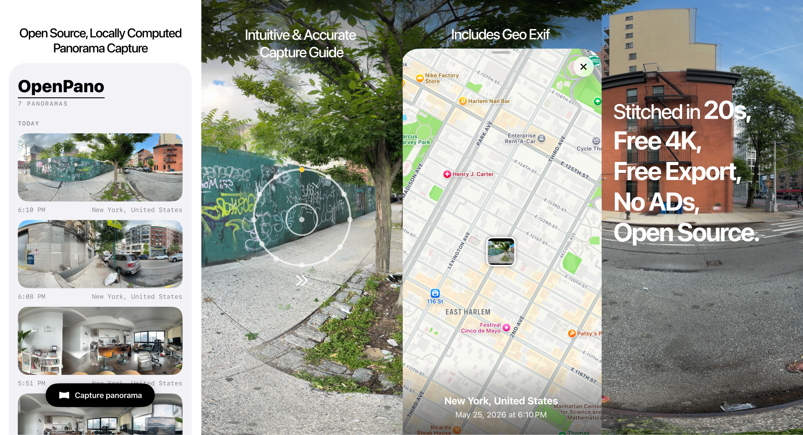
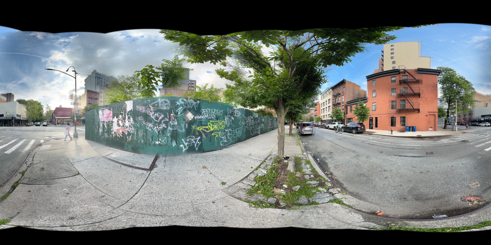
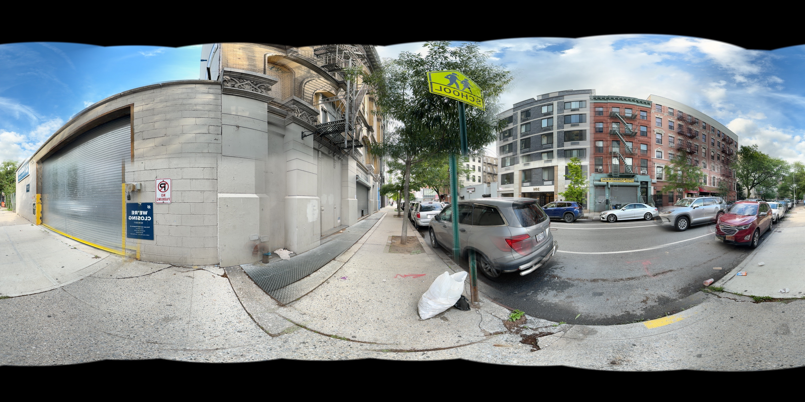
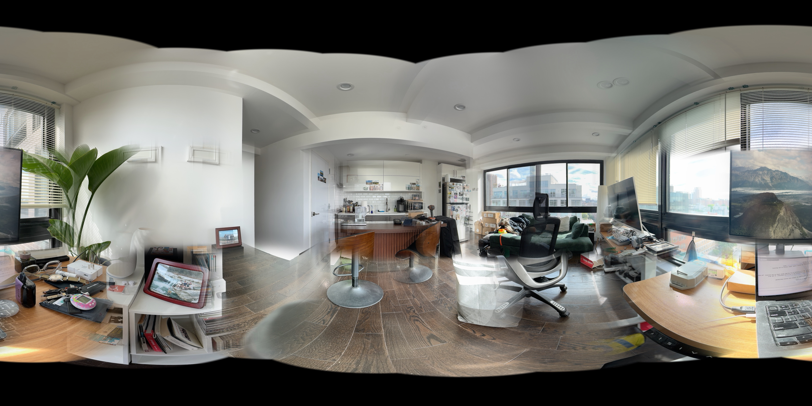

# OpenPano

  

An open-source iOS app for capturing and viewing 360° equirectangular panoramas, developed by Aako, Inc.

While building the [Aako App](https://apps.apple.com/us/app/aako-memory-map/id6503721703), we researched and built a panorama framework that uses ARKit's camera-pose data to capture and stitch equirectangular panoramas — **no feature matching, no OpenCV, and every computation runs locally on your iPhone.** In our testing the results came out simply **better** than most apps, which lean on cloud compute and charge you for it. It's 2026 — a great panorama shouldn't be locked behind a server or a subscription. So we open-sourced ours for everyone to use and build on. It's ideal for photographers, for data collection, and for anyone working on world models or 3D Gaussian splatting (3DGS).

## Sample panoramas

Real 4096×2048 equirectangular panoramas captured and stitched entirely on an iPhone — no cloud, no manual editing.

  
   <em>Street corner — East Harlem, New York</em>

  
   <em>Sidewalk view — New York</em>

  
   <em>Bad example: Interior — apartment living space</em>

## Known issues

As you can see in the sample panoramas, the results aren't perfect yet. Two factors cause most of the artifacts:

1. **Moving too fast while capturing.** Quick motion gives ARKit noisier pose data, and the projection is only as good as that ground truth.
2. **Objects too close to the camera.** Because we stitch multiple frames taken from slightly different angles, nearby objects shift between shots (parallax) and don't line up cleanly.

You'll get the best results by standing somewhere open, well away from anything close by — the middle of a plaza is ideal — and turning slowly and steadily.

We're actively working on improving the algorithm to reduce these artifacts. Contributions are very welcome!

## Features

- **Date-grouped gallery** — captured panoramas listed by day (Today, Yesterday,
  …) as wide banners, each showing its capture time and reverse-geocoded
  location (City, Country, with a raw lat/lon fallback). A bottom **Capture
  panorama** button starts a new capture; long-press a panorama to delete it.
- **Guided capture** — an ARKit-driven aiming reticle walks you through three
  rows (level, up, down) of overlapping photos, then projects them into a
  4096×2048 equirectangular image with a live progress screen.
- **Immersive viewer** — look around a panorama on the inside of a sphere.
  Toggle between **gyroscope** and **finger drag** control, with Liquid Glass
  controls.
- **Geotagging** — capture location is recorded, persisted, and embedded as
  **EXIF/GPS metadata** in the saved JPEG.
- **Save & share** — save to your photo library (with location preserved) or
  export through the native iOS share sheet.

## Architecture

| File | Role |
| --- | --- |
| `Panorama360CaptureView.swift` | ARKit guided multi-row capture UI |
| `EquirectangularProjector.swift` | Sensor-based equirectangular projection engine |
| `PanoramaSphereView.swift` | SceneKit sphere viewer (gyro + drag) |
| `PanoramaDetailView.swift` | Viewer chrome: controls, save/share, map info sheet |
| `PanoramaGalleryView.swift` | Date-grouped gallery, About sheet, reverse geocoding |
| `PanoramaStore.swift` | On-disk persistence (JPEG + coordinate metadata) |
| `LocationProvider.swift` | CoreLocation wrapper used during capture |
| `UIImage+Pano.swift` | Image scaling, thumbnail downsampling, EXIF/GPS JPEG encoding |

## Requirements

- iOS 26.2+
- A device with a rear camera and gyroscope (capture needs ARKit; it does not
  run in the Simulator). The viewer's gyro mode and geotagging need a real
  device too.

## Permissions

- **Camera** — capturing the panorama frames.
- **Motion** — gyroscope look-around in the viewer.
- **Location (When In Use)** — tagging each panorama with where it was taken.
- **Photo Library (Add)** — saving panoramas to Photos.

## Build

Open `openpano.xcodeproj` in Xcode, select your device, and run. Set your own
development team and bundle identifier in the target's signing settings.

## How capture works

1. Hold the phone in landscape and slowly rotate to fill the reticle ring at
   each target angle. The app captures automatically when you hold steady.
2. After the level row, it advances to the up and down rows.
3. Tap **Done** any time after two photos to finish early, or complete all rows.
4. The captured frames are inverse-mapped onto a sphere: for each output pixel
   the projector finds the best-facing source image (weighted by angle and edge
   distance) and blends overlapping contributions.
5. The finished panorama is saved with its capture location, and the app opens
   straight into the immersive viewer.

## Contributing

Contributions are welcome! Open a pull request with your changes and we'll
review and merge it. Whether it's a bug fix, a new feature, or a docs
improvement, we'd love your help making OpenPano better.

## License

MIT — see [LICENSE](LICENSE).
